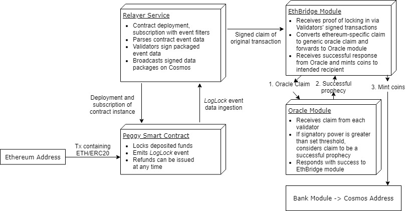

# An opportunity to bridge Cosmos and Zilliqa for unique benefit

The Cosmos dapp-chains concept does condemn the idea of smart contract platforms for running tokens, but the complexities of IBC, PoS and Tendermint make it hard to prototype and iterate on complex objects or interactions such as NFTs, reputation systems. I personally believe that smart contract platforms are the future, because my study of Mechanism Design repeatedly indicates how difficult or impossible it is to have flexibility at the protocol level, so just pay for decentralized state execution and get more value than costs. Zilliqa offers this, its architecture is similar enough to Ethereum's to be familiar and with only a question of how to handle sharding, any solidity contract I've found can be neatly 1-to-1 translated to Scilla.

**At the marketing-level, Zilliqa offers:**

* Transaction sharding for a hash-rate scaled throughput already in the 100's to thousands of TPS.
* Predictability regarding costs and finality due to replacement of Nakamoto consensus with pBFT.
* PoW security, but avoiding most of the waste by only relying on PoW for sybil resistance in the mining pools. Only 12 hours of PoW are run per month. 
* Smart contracts in Scilla - a turing-incomplete (intentionally) language that is based on Coq and Ocaml, designed from the ground-up from the theory of communicating automata (pi calculus). 
* Ledger wallet integration, several app wallets and a browser-wallet like metamask (Zilpay)
* Schnorr signatures for unmalleable payloads, advanced signature schemes like BNS possible. 

**Zilliqa is not without its flaws, for now:**
* no dex
* few existing token standards
* few developers outside the existing Zilliqa team
* one company runs most of the infrastructure
* The DS committee can be DDOSed, stalling the network.

I've chosen Zilliqa as my platform to develop on because it has enough innovative solutions to existing problems and its own in place that I believe, unless it is abandoned it will evolve into a public blockchain that will be sufficient for the next several decades. It is not the solution to everything, often you want a 'sidechain' or other DAG to accomplish different goals than a blockchain. For this reason and their broad compabitility, I suggest a project exploring bridging these two ecosystems. It will not need all the complexity of IBC, as cosmos and Zilliqa share many commonalities and some incidental compatibility that we may exploit. Cosmos is also modular enough that, should a tighter integration be needed, it could be achieved by using Schnorr signatures for the Cosmos chain. 

This specific writeup comes as an offered alternative - it is going to be difficult to get any kind of NFT right on Cosmos, but we can mint and manage (and trade) the ecological NFTs central to Regen Network's mission, Global Mangrove Trust and Generation Blue. The secondary and floating currencies can still run on Cosmos or some combination of Cosmos and Zilliqa with bridged transfers, enabling cheaper or free transactions and finer-grained control than a rigidly public mainchain can provide alone. This could shorten the time to launch for Regen, and benefit both the Zilliqa and Cosmos projects present and future with greater versatility within their reach. It will be a largely repeatable process that once signatures are created on one chain and validated on the other, many exciting new patterns become possible. 

**On the protocol level Zilliqa uses:**
* Schnorr or ECDSA signatures validated within contracts
* Transactions over JSON-RPC (Schnorr only)
* Protocol buffers for node communication
* Bech32 addresses, secp256k1 curve
* PoW for Sybil Resistance, pBFT for consensus and finality

More details can be found in the [white paper](https://docs.zilliqa.com/whitepaper.pdf), and as far as I can tell their architecture hasn't drifted from it except in some details of sharding procedure. 

## From IBC to communicating signatures

The above diagram shows the Peggy architecture, which we can simplify a little by assuming that Cosmos wallets only need to have sovereignty over already minted NFTs (Regen can manage a set of Zilliqa keys to deploy and manage the contracts). The minting and issuance process can simply make a map of Cosmos public keys for NFT holders. Then when an NFT owner wants to interact, they can use their familiar wallet to send a transaction to the Relayer service, wihch then simply takes the ECDSA signed transaction by a user's existing public key, extracts a relevant digest from the transaction and calls the smart contract transition, feeding it the public key, signature and digest without modification. This maintains the decentralized/cryptographic properties that makes the blockchain desirable without requiring a user to engage in needless complexity. 

IBC is both very complex as it is a general process, and incomplete. I believe that we can use the existing Cosmos-Ethereum IBC prototype, Peggy to motivate our discussion of how to bridge Cosmos and Zilliqa and leave out uneccesary parts for now. If we assume that a user of Regen will mostly live in the Cosmos ecosystem, and use its wallets, then we can assume it is signing transactions as JSON payloads with ECDSA signatures. This means that our bridge is one-way, allowing Cosmos users to interact with NFTs hosted on Zilliqa without needing to know what that means. However, Zilliqa users will still need to get a signing wallet in the Cosmos system to do so. Mainly because no existing Zilliqa wallets support ECDSA, as Schnorr is the transactions signing standard. It is a curious convenience that Scilla supports both. 
## Future possibilities

There is a wallet that uses Perfect forward secrecy to hide the complexities of wallet key management from users. [Tor.us](https://tor.us/) is a tendermint based web wallet that splits private keys derived from Google, Facebook, etc OAuth keys into 3 shares for easy recovery by the user and (theoretically) perfect privacy and security. I've spoken with them several times about Zilliqa integrations, implementing the Secp256k1 curve is the only technical barrier to that - then someone could conceivably have different private keys, but still seem as the same user across Cosmos, Zilliqa and Ethereum. This may prove to be more useful than an IBC or atmoic swap protocol for Regen network.  
